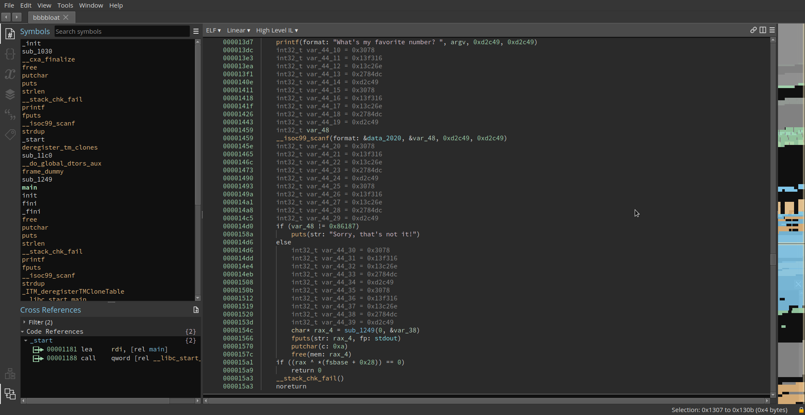
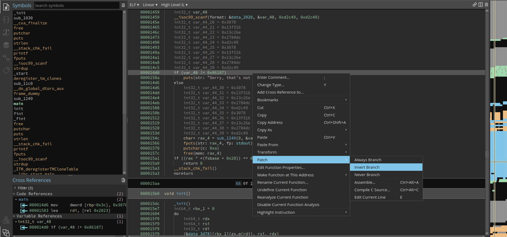

# Description

Can you get the flag?
Reverse engineer this binary.

# Solution:

Testing the exectuable with a random number will no work:

```bash
┌──(A㉿vagrant)-[~/pwn]
└─$./bbbbloat
What's my favorite number? 1
Sorry, that's not it!
```

So let's import it to binary ninja and go to the main function


We can easily make the program give us a flag with any input, in binaryninja rightclick the if statement and select patch then invert


Executing in now will succefully give us the flag
```bash
┌──(A㉿vagrant)-[~/pwn]
└─$ ./bbbbloat_patched
What's my favorite number? tltachsb3awtlatin
picoCTF{*REDACTED*}
```
