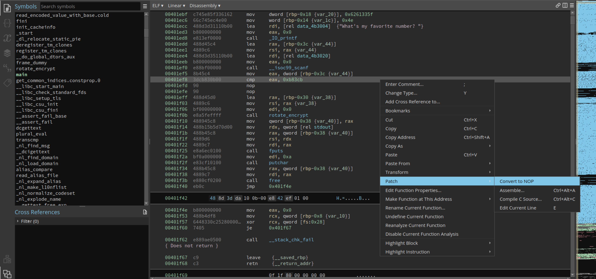
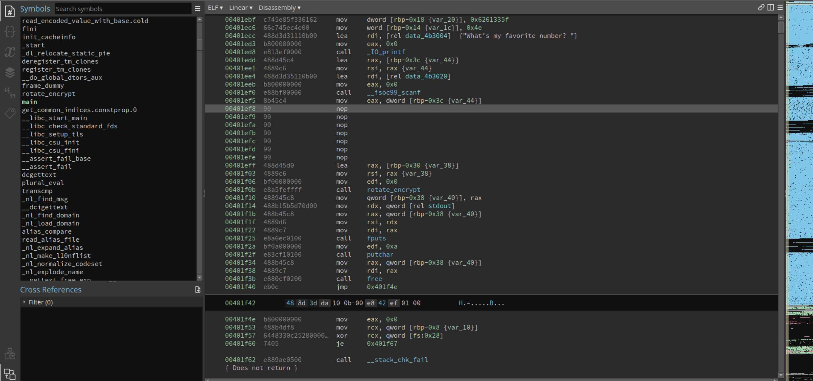

# Unpackme-upx

From the the name of the challenges it's fairly obvious what we need to do.
Let's unpack the binary:
```bash
$ upx -d unpackme-upx
```

Loading the file in binaryninja we can easily solve it by converting the cmp to nops so it doesnt check our input and give us the flag



We will get this




